<div align="center">


<h1>Identity Governance Framework</h1>

<p><strong>The Institutional-Grade Platform for Identity Lifecycle Management (IGA), Access Certification, and Compliance Governance.</strong></p>

[]()
[]()
[]()

<br/>

> **"Identity is the ultimate perimeter."** 
> **Identity Governance Framework** is an enterprise-grade platform designed to provide a secure, measurable, and highly automated foundation for global identity governance (IGA) operations. It orchestrates the complex lifecycle of identity access—from JML (Joiner, Mover, Leaver) automation and multi-stage access certification to toxic combination (SoD) detection and unified identity lifecycle auditing.

</div>

---

## 🏛️ Executive Summary

Fragmented identity lifecycles and manual access reviews are strategic operational liabilities; lack of centralized governance orchestration is a primary barrier to organizational Zero Trust maturity. Organizations fail to maintain a secure identity posture not because of a lack of directories, but because of fragmented governance standards, lack of automated entitlement validation, and an inability to orchestrate identity landing zones with operational precision.

This platform provides the **Governance Intelligence Plane**. It implements a complete **Enterprise Governance-as-Code Framework**, enabling Security and Compliance teams to manage global identity lifecycles as first-class citizens. By automating the identification of toxic permission combinations through real-time entitlement analysis and orchestrating the JIT provisioning of temporary access, we ensure that every organizational identity—from core directory admins to routine application users—is governed by default, audited for history, and strictly aligned with institutional governance frameworks.

---

## 📐 Architecture Storytelling: Principal Reference Models

### 1. Principal Architecture: Global Identity Governance & Compliance Intelligence Plane
This diagram illustrates the end-to-end flow from human and machine identity ingestion to JML automation, access certification, SoD validation, and institutional governance auditing.

```mermaid
graph LR
    %% Subgraph Definitions
    subgraph IdentityIngress["Human & Machine Ingress"]
        direction TB
        HR_Systems["Workday / SAP / BambooHR"]
        Machine_Registry["Workload & Bot Registry"]
        Partner_Directory["B2B & Guest Directories"]
    end

    subgraph IntelligenceEngine["Governance Intelligence Hub"]
        direction TB
        API["FastAPI Governance Gateway"]
        JML_Orchestrator["Joiner / Mover / Leaver Hub"]
        CertificationEngine["Access Review & Cert Hub"]
        SoD_Validator["Toxic Combination (SoD) Hub"]
    end

    subgraph OperationsPlane["Distributed Governance Fleet"]
        direction TB
        ProvisioningWorkers["JIT & Lifecycle Pushers"]
        EntitlementScanners["AIOps Privilege Pattern Scanners"]
        ReviewProxies["Attestation & Review Proxies"]
    end

    subgraph OperationsHub["Institutional Governance Hub"]
        direction TB
        Scorecard["Governance Maturity Score"]
        Analytics["Certification & JML Stats"]
        Audit["Forensic Governance Metadata Lake"]
    end

    subgraph DevOps["Governance-as-Code Framework"]
        direction TB
        TF["Terraform Governance Modules"]
        PrivilegeBot["Shadow Admin Drift Validator"]
        ChatOps["Access Approval Hub"]
    end

    %% Flow Arrows
    IdentityIngress -->|1. Submit Identity Event| API
    API -->|2. Orchestrate JML| JML_Orchestrator
    JML_Orchestrator -->|3. Validate SoD| SoD_Validator
    SoD_Validator -->|4. Trigger Review| CertificationEngine
    
    CertificationEngine -->|5. Execute Provision| OperationsPlane
    OperationsPlane -->|6. Notify Status| ChatOps
    API -->|7. Visualize Health| Scorecard
    
    Scorecard -->|8. Track Maturity| Analytics
    Scorecard -->|9. Record Event| Audit
    
    TF -->|10. Provision Hub| IntelligenceEngine
    PrivilegeBot -->|11. Inject Privilege Risk| JML_Orchestrator
    Audit -->|12. Improve Governance| ProvisioningWorkers

    %% Styling
    classDef ingress fill:#f5f5f5,stroke:#616161,stroke-width:2px;
    classDef intel fill:#e8eaf6,stroke:#1a237e,stroke-width:2px;
    classDef operations fill:#e1f5fe,stroke:#01579b,stroke-width:2px;
    classDef ops fill:#ede7f6,stroke:#311b92,stroke-width:2px;
    classDef devops fill:#e8f5e9,stroke:#1b5e20,stroke-width:2px;

    class IdentityIngress ingress;
    class IntelligenceEngine intel;
    class OperationsPlane operations;
    class OperationsHub ops;
    class DevOps devops;
```

### 2. The Identity Governance Lifecycle Flow
The continuous path of an identity governance request from initial request and approval (quorum) to active JIT provisioning, certification (review), revocation, and institutional forensic auditing.

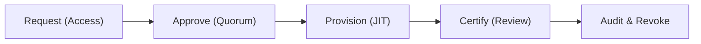

### 3. Distributed Identity Governance Topology
Strategically orchestrating governance across global engineering geographic clusters and multi-cloud environments, providing a unified institutional view of global identity health and lifecycle maturity.

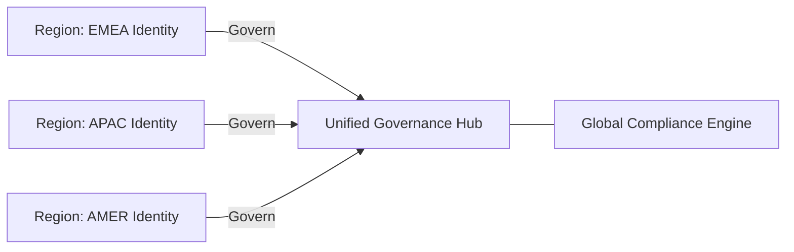

### 4. Joiner, Mover, Leaver (JML) Automation Flow
Executing complex logic for managing the lifecycle of human identities from onboarding to offboarding, ensuring every organizational identity is provisioned and de-provisioned according to institutional standards.

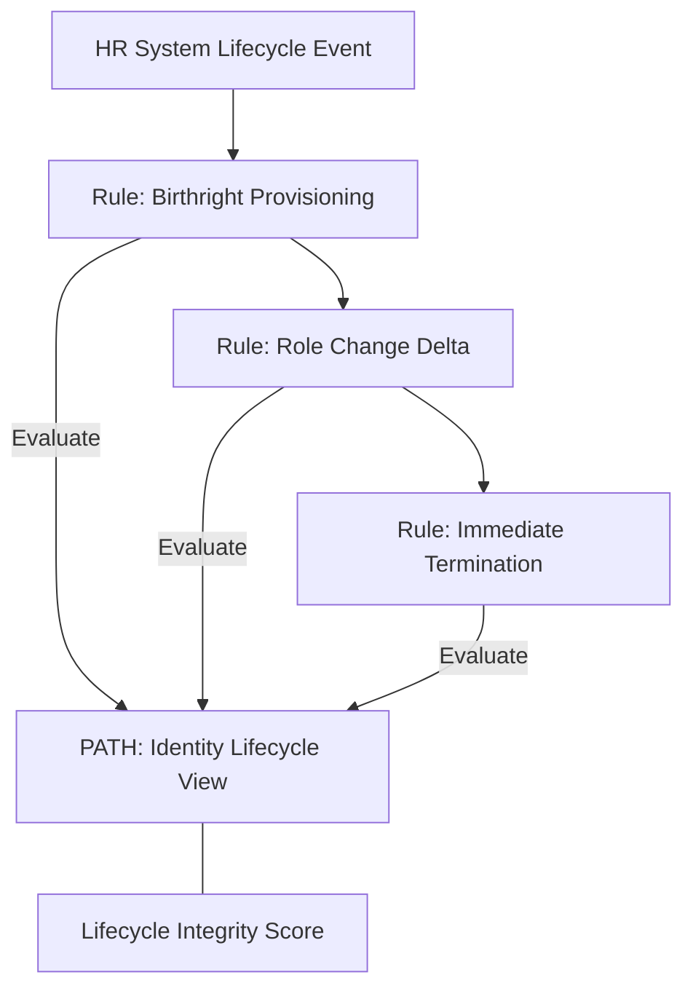

### 5. Multi-Stage Access Review & Certification Flow
Automatically verifying user access against institutional security and compliance standards, managing multi-stage approvals and automated remediation, ensuring institutional audit readiness by default.

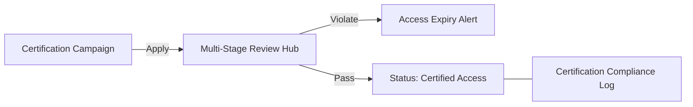

### 6. Just-In-Time (JIT) Provisioning & Auto-Revocation Flow
Managing the lifecycle of a privileged request, automatically ensuring users only have the access they need, exactly when they need it, with automated cleanup, ensuring zero-latency security confidence.

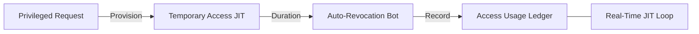

### 7. Institutional Identity Maturity Scorecard
Grading organizational performance based on key indicators: Access Review Completion, JIT Adoption Rate, and Toxic Combination (SoD) Coverage Index.

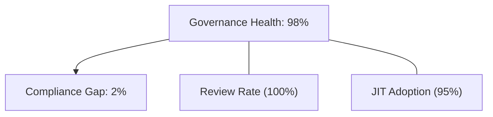

### 8. Identity & RBAC for Governance Roles
Managing fine-grained access to governance hubs, provisioning workers, and audit logs between Identity Governors, Access Reviewers, and Resource Owners.

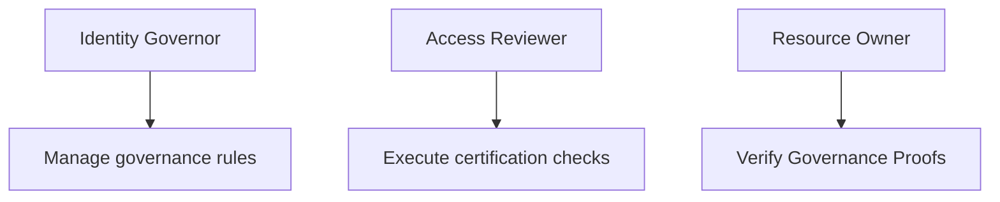

### 9. IaC Deployment: Governance-as-Code Framework
Using modular Terraform to deploy and manage the versioned distribution of the governance tracking hubs, lifecycle workers, and forensic metadata lakes.

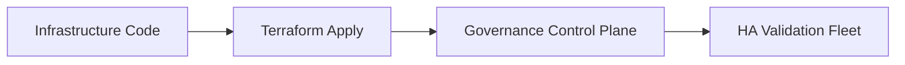

### 10. AIOps Toxic Combination & SoD Validation Flow
Using advanced analytics to identify sudden surges in Segregation of Duties (SoD) violations, suspicious privilege escalations, or unusual entitlement pattern changes that could result in institutional risk.

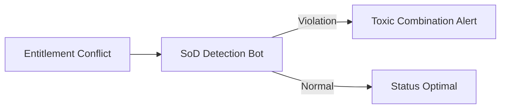

### 11. Metadata Lake for Forensic Governance Audit
Storing long-term records of every access request, every approval decision recorded, and every certification event for institutional record-keeping, compliance auditing, and post-governance forensics.

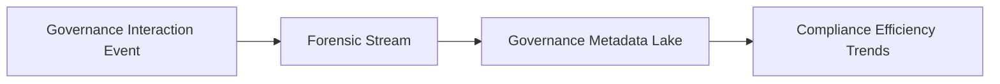

---

## 🏛️ Core Governance Pillars

1.  **Unified Lifecycle Coordination**: Maximizing resilience by centralizing all identity governance through a single institutional plane.
2.  **Automated Entitlement Validation**: Eliminating "shadow privilege" scenarios through proactive scoring and pattern verification.
3.  **Sequential Synchronization Intelligence**: Ensuring zero-interruption operations through dependency-aware multi-cloud provisioning.
4.  **Zero-Trust Access Protection**: Automatically enforcing identity-based access and rule evaluation across all governance tiers.
5.  **Autonomous Governance Logic**: Guaranteeing reliability through automated industry-specific identity monitoring runbooks.
6.  **Full Governance Auditability**: Immutable recording of every access decision and certification for institutional forensics.

---

## 🛠️ Technical Stack & Implementation

### Governance Engine & APIs
*   **Framework**: Python 3.11+ / FastAPI.
*   **JML Engine**: Custom Python-based logic for lifecycle automation and DORA-style identity metrics.
*   **Integrations**: Native connectors for HR Systems (Workday), IdPs (Entra ID, Okta), and Cloud IAM APIs.
*   **Persistence**: PostgreSQL (Governance Ledger) and Redis (Live Governance State).
*   **Auth Orchestrator**: Federated OIDC/SAML for least-privilege identity management access.

### Governance Dashboard (UI)
*   **Framework**: React 18 / Vite.
*   **Theme**: Dark, Indigo, Slate (Modern high-fidelity governance aesthetic).
*   **Visualization**: D3.js for entitlement topologies and Recharts for certification velocity analytics.

### Infrastructure & DevOps
*   **Runtime**: AWS EKS or Azure Kubernetes Service (AKS) for management plane.
*   **Governance Hub**: Managed event sourcing for immutable identity security timeline reconstruction.
*   **IaC**: Modular Terraform for deploying the governance landing zone and validation fleet.

---

## 🏗️ IaC Mapping (Module Structure)

| Module | Purpose | Real Services |
| :--- | :--- | :--- |
| **`infrastructure/gov_hub`** | Central management plane | EKS, PostgreSQL, Redis |
| **`infrastructure/workers`** | Distributed lifecycle provisioners | K8s Workers, Cloud APIs |
| **`infrastructure/connectors`** | HR & IdP Ingestion Hubs | Webhooks, Lambda |
| **`infrastructure/auditing`** | Forensic governance sinks | S3, Athena, Quicksight |

---

## 🚀 Deployment Guide

### Local Principal Environment
```bash
# Clone the governance platform
git clone https://github.com/devopstrio/identity-governance-framework.git
cd identity-governance-framework

# Configure environment
cp .env.example .env

# Launch the Governance stack
make init

# Trigger a mock JML event and automated access certification simulation
make simulate-governance
```

Access the Governance Dashboard at `http://localhost:3000`.

---

## 📜 License
Distributed under the MIT License. See `LICENSE` for more information.

---
<div align="center">
  <p>© 2026 Devopstrio. All rights reserved.</p>
</div>
