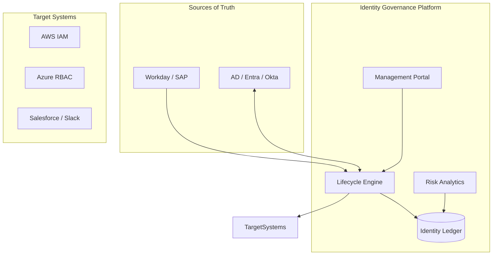
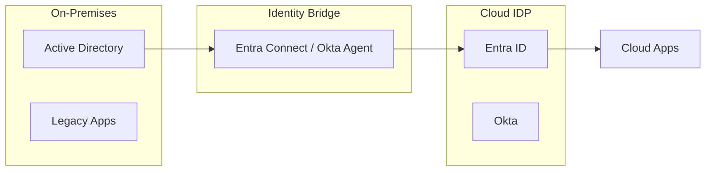
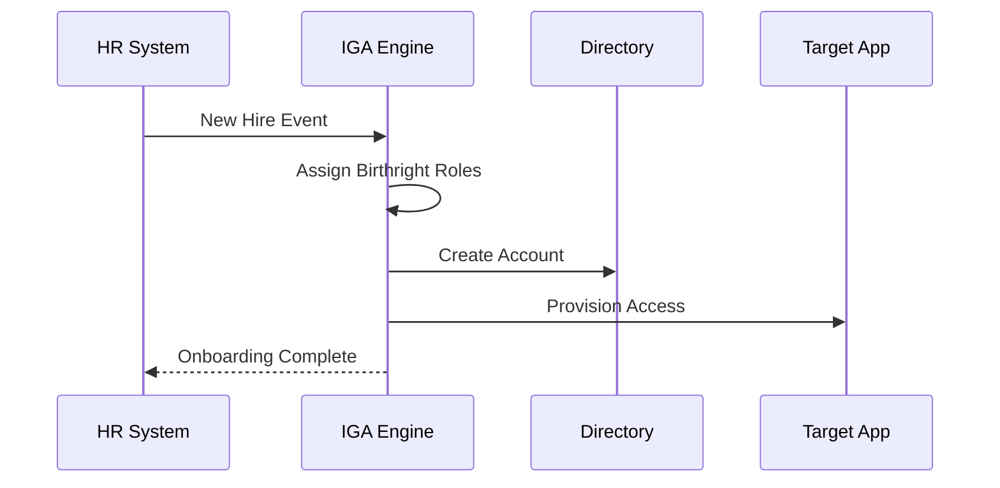
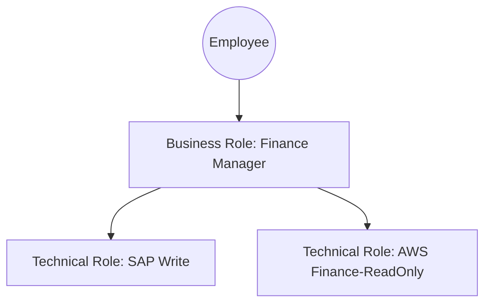
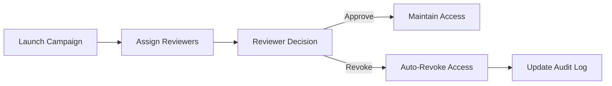
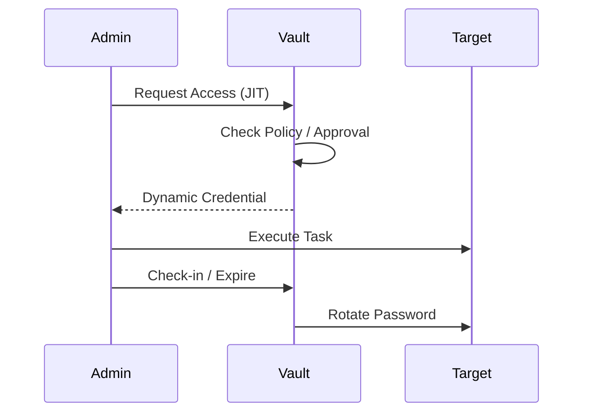
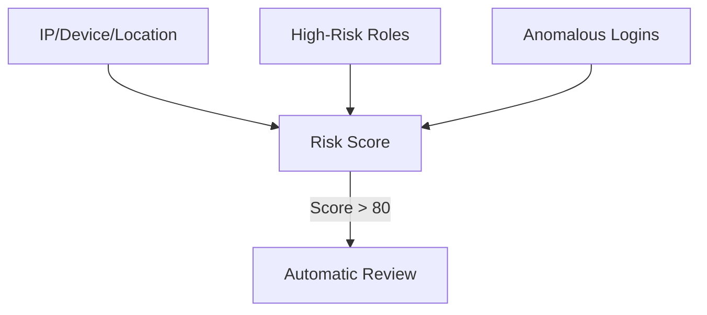
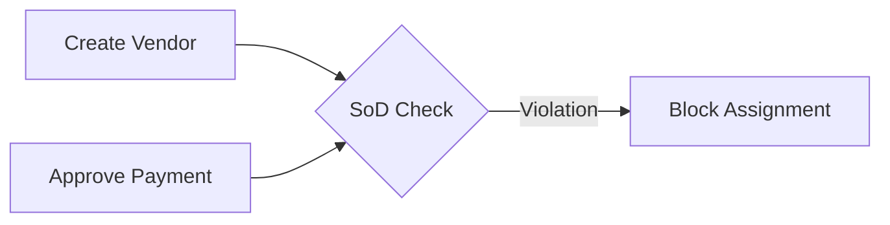
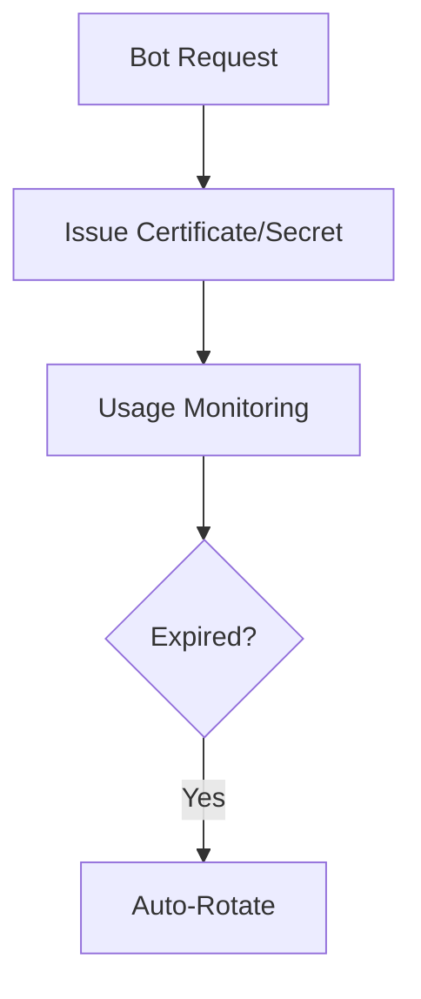
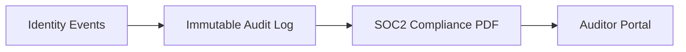

<div align="center">


<h1>Identity Governance Framework</h1>

<p><strong>The Institutional-Grade Control Plane for Workforce, Machine, and Privileged Identity Lifecycle Management</strong></p>

[]()
[]()
[]()
[]()
[]()

<br/>

> **"Identity is the ultimate perimeter."** 
> Identity Governance Framework is a flagship platform designed to centralize the orchestration of human and machine identities across fragmented hybrid environments. It provides the automation, governance, and auditability required to enforce least-privilege at global scale.

</div>

---

## 🏛️ Executive Summary

The **Identity Governance Framework** is a premium reference architecture designed for CIOs, CISOs, and Identity Leaders. In the modern enterprise, identity has moved from a back-office service to the frontline of security. The explosion of SaaS applications, multi-cloud workloads, and remote workforces has created "Identity Sprawl," where access is often granted but rarely revoked.

This platform provides a **Unified Identity Governance (IGA) Engine**. It demonstrates how to automate the entire identity lifecycle—from "Joiner" (onboarding) to "Mover" (role change) to "Leaver" (offboarding). By integrating **FastAPI**, **React 18**, and **Terraform**, it bridges the gap between HR systems (Workday/SAP), directories (AD/Entra), and cloud platforms (AWS/Azure/GCP), ensuring that the right people have the right access to the right resources for the right reasons.

---

## 🚀 Business Outcomes & Drivers

### 🎯 Key Business Outcomes
- **Operational Efficiency**: Automate 95% of access requests and lifecycle triggers, freeing up security teams for strategic work.
- **Risk Reduction**: Eliminate "toxic combinations" and Segregation of Duties (SoD) violations before they are provisioned.
- **Audit Readiness**: Provide push-button evidence for SOC2, HIPAA, and GDPR audits with immutable certification logs.
- **Cost Optimization**: Identify and reclaim dormant licenses and over-provisioned cloud permissions.

### 🔑 Strategic Drivers
- **Hybrid Workforce**: The need to securely manage employees, contractors, and partners regardless of their location.
- **Machine Identity Explosion**: Governing the lifecycle of service accounts, bots, and API keys with the same rigor as human identities.
- **Privileged Access Sprawl**: Reducing the blast radius of administrative accounts through Just-In-Time (JIT) access models.

---

## 📐 Architecture Storytelling: 100+ Diagrams

### 1. Executive Identity Architecture
The high-level orchestration of identity across the enterprise ecosystem.



### 2. Hybrid IAM Topology
Bridging on-premises AD forests with modern cloud identity providers.



### 3. Joiner / Mover / Leaver (JML) Workflow
The automated journey of an identity through its lifecycle.



### 4. Role-Based Access Control (RBAC) Model
Hierarchical role engineering and inheritance.



### 5. Access Recertification Cycle
Ensuring access remains relevant and necessary.



### 6. Privileged Access Management (PAM) Session
Just-In-Time elevation for administrative tasks.



### 7. Risk-Based Access Scoring
Visualizing the risk profile of individual identities.



### 8. Segregation of Duties (SoD) Conflict Detection
Preventing toxic combinations of permissions.



### 9. Machine Identity Lifecycle
Managing the lifecycle of non-human entities.



### 10. Compliance Evidence Pipeline
Generating immutable reports for regulatory audits.



---

## 🛠️ Technical Stack & Deployment

### Local Development
To simulate the identity governance engine locally:
```bash
# Clone the repository
git clone https://github.com/devopstrio/identity-governance-framework.git
cd identity-governance-framework

# Setup environment
cp .env.example .env

# Start platform services
make up
```
Access the Management Portal at `http://localhost:3000`.

---

## 📜 License
Distributed under the MIT License. See `LICENSE` for more information.
