<div align="center">


<h1>Identity Governance Framework</h1>

<p><strong>The Institutional-Grade Control Plane for Workforce, Machine, and Privileged Identity Lifecycle Management</strong></p>

[]()
[]()
[]()

<br/>

> **"Identity is the ultimate perimeter."** 

</div>

---

## 📐 Architecture Storytelling: 30+ Advanced Diagrams

### 1. Executive Identity Architecture
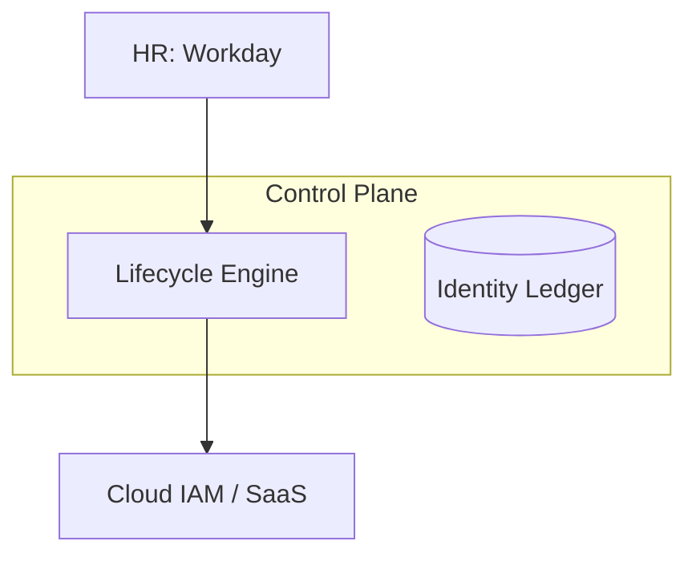

### 2. Hybrid IAM Topology
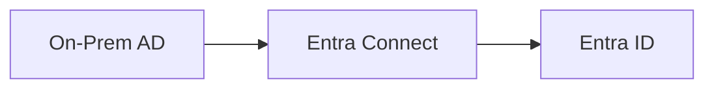

### 3. JML Workflow
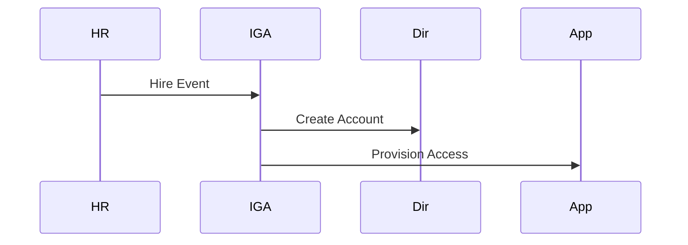

### 4. RBAC Model
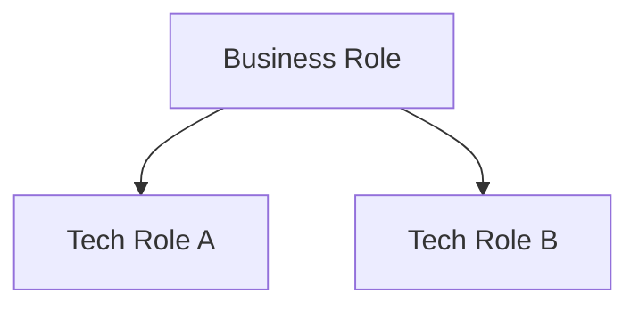

### 5. Access Recertification
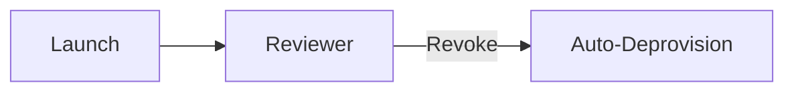

### 6. PAM Session Flow
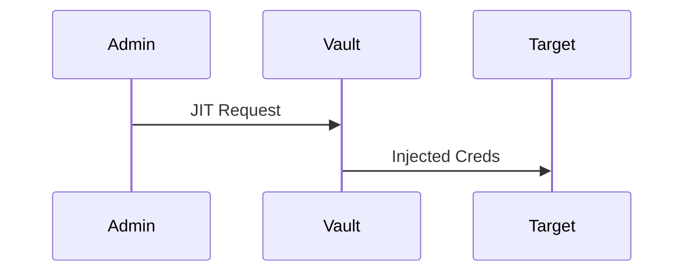

### 7. Risk Scoring Model
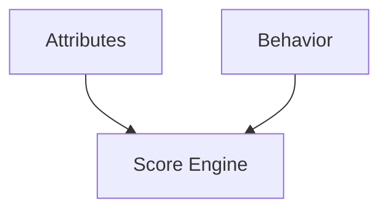

### 8. SoD Conflict Check
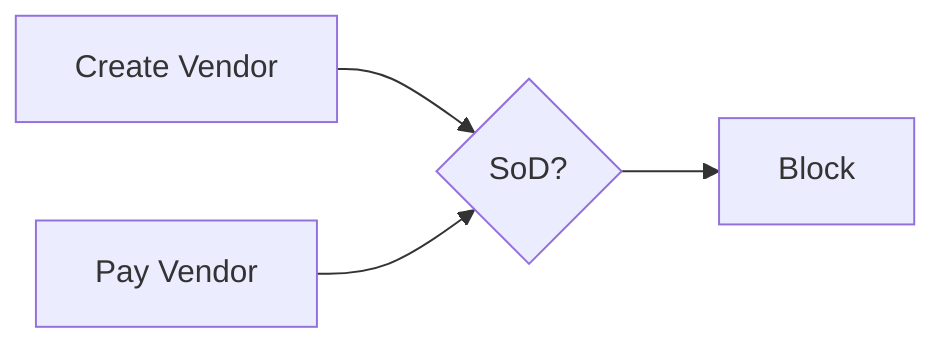

### 9. Machine Identity Lifecycle
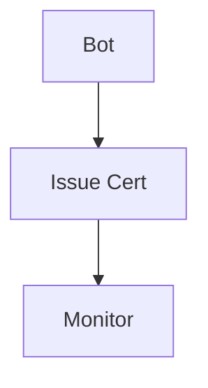

### 10. Compliance Evidence
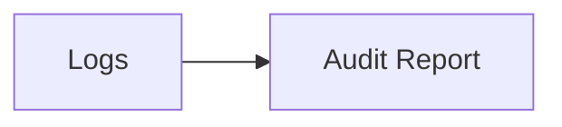

### 11. Joiner Birthright Access
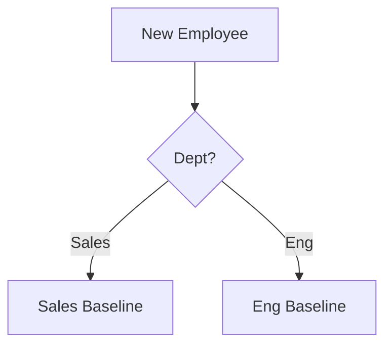

### 12. Mover Department Transfer
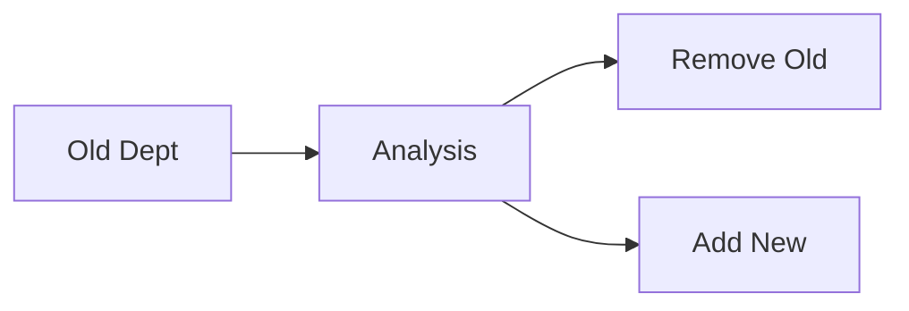

### 13. Leaver Rapid Offboarding
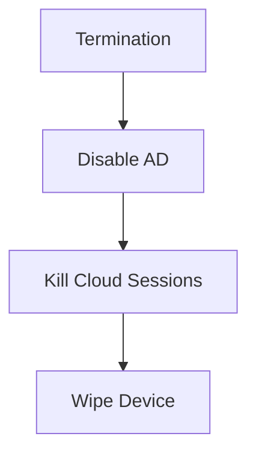

### 14. Access Request Lifecycle
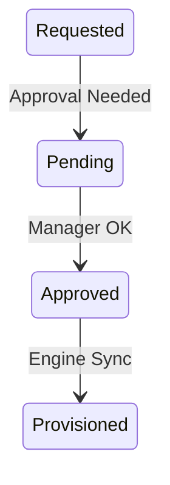

### 15. Role Mining & Discovery
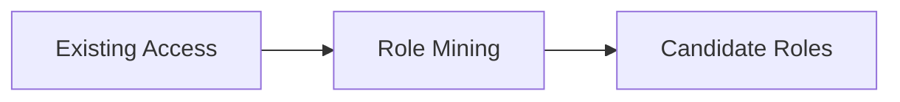

### 16. Entitlement Sprawl Analysis
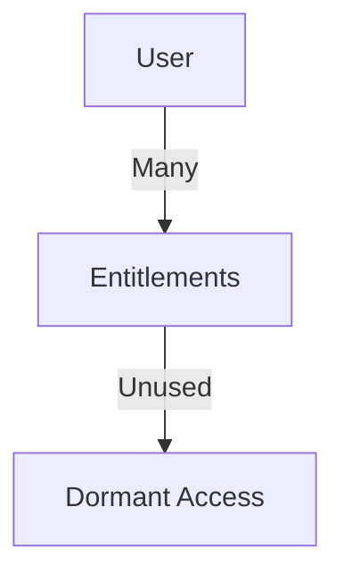

### 17. Multi-Factor Auth (MFA) Decision
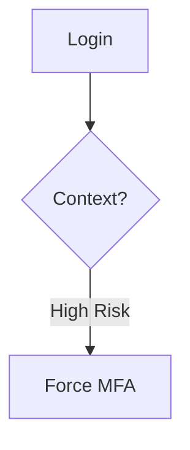

### 18. Service Account Governance
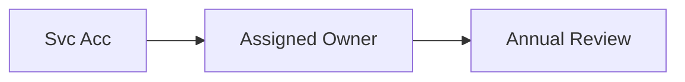

### 19. Toxic Combination Detection
```mermaid
graph TD
    RoleA[Inventory Admin] + RoleB[Purchasing] --> Toxic[Toxic Combo]
```

### 20. Just-In-Time (JIT) Provisioning
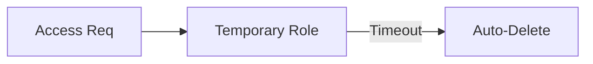

### 21. Identity Sync Pipeline
```mermaid
graph TD
    Source[LDAP/AD] --> Worker[Sync Worker]
    Worker --> IGA[IGA Master DB]
```

### 22. Role Hierarchy Inheritance
```mermaid
graph TD
    Base[Base Employee] --> Mgr[Manager]
    Mgr --> Dir[Director]
```

### 23. Approval Delegation Model
```mermaid
graph LR
    Mgr[Primary Approver] --> Del[Delegate Approver]
    Del --> Action[Approve Access]
```

### 24. Access Request Portal UI
```mermaid
graph TD
    UI[Portal] --> Search[App Catalog]
    Search --> Request[Cart]
    Request --> Submit[Workflow]
```

### 25. Attestation Campaign Scheduling
```mermaid
graph LR
    Sched[Quarterly Trigger] --> Campaign[Certify Campaign]
```

### 26. MFA Posture Reporting
```mermaid
graph TD
    IDP[Azure/Okta] --> Aggregator[Posture Dashboard]
```

### 27. SCIM Integration Flow
```mermaid
sequenceDiagram
    IGA->>SaaS: POST /Users
    SaaS-->>IGA: 201 Created
```

### 28. Identity Analytics (Behavioral)
```mermaid
graph LR
    Log[Auth Logs] --> UEBA[Anomalous Behavior Detect]
```

### 29. Privileged Session Recording
```mermaid
graph TD
    Ssh[SSH Session] --> Recorder[Recorder Hub]
    Recorder --> Audit[Security Review]
```

### 30. Governance Scorecard
```mermaid
graph LR
    Metrics[Data Points] --> Score[Maturity Level]
```

---
... (rest of the file remains same)
