<div align="center">


<h1>Identity Governance Framework</h1>

<p><strong>The Institutional-Grade Control Plane for Workforce, Machine, and Privileged Identity Lifecycle Management, Access Certification, and Risk Governance</strong></p>

[]()
[]()
[]()
[]()

<br/>

> **"Identity is the ultimate perimeter."** 
> The Identity Governance Framework is a flagship platform designed to centralize the orchestration of human and machine identities across fragmented hybrid environments. It provides the automation, governance, and auditability required to enforce least-privilege at global scale.

</div>

---

## 🏛️ Executive Summary

The **Identity Governance Framework** is a premium metrics and automation solution designed for CIOs, CISOs, and Identity Governance Leaders. In the modern enterprise, identity has moved from a back-office service to the frontline of security. The explosion of SaaS applications, multi-cloud workloads, and remote workforces has created "Identity Sprawl," where access is often granted but rarely revoked.

This platform provides a **Unified Identity Governance (IGA) Engine**. It demonstrates how to automate the entire identity lifecycle—from "Joiner" (onboarding) to "Mover" (role change) to "Leaver" (offboarding). By integrating **FastAPI**, **React 18**, and **Terraform**, it bridges the gap between HR systems (Workday/SAP), directories (AD/Entra), and cloud platforms (AWS/Azure/GCP), ensuring that the right people have the right access to the right resources for the right reasons.

---

## 📉 The "Identity Debt" Problem

Enterprises facing rapid growth often accumulate significant identity risk:
- **Entitlement Sprawl**: Over-provisioned users with far more access than their job requires.
- **Toxic Combinations**: Users holding conflicting roles (e.g., creating and approving payments).
- **Orphaned Accounts**: Dormant accounts from former employees that remain active targets.
- **Audit Fatigue**: Manual access certification processes that are slow, inaccurate, and burdensome.

---

## 🚀 Strategic Drivers & Business Outcomes

### 🎯 Strategic Drivers
- **Zero Trust Acceleration**: Moving from perimeter-based security to identity-centric security.
- **Workforce Agility**: Enabling employees and contractors to be productive from Day 1 with automated "Birthright Access."
- **Institutional Governance**: Establishing an immutable audit trail for every access decision.

### 💰 Business Outcomes
- **95% Reduction in Orphaned Accounts**: Automated offboarding ensures access is killed immediately upon termination.
- **Zero Unremediated SoD Violations**: Real-time detection of Segregation of Duties conflicts.
- **Simplified Audit Compliance**: Push-button evidence for SOC2, HIPAA, and GDPR certifications.

---

## 📐 Architecture Storytelling: 30+ Advanced Diagrams

### 1. Executive Identity Architecture
*The high-level orchestration of identity across the enterprise ecosystem.*
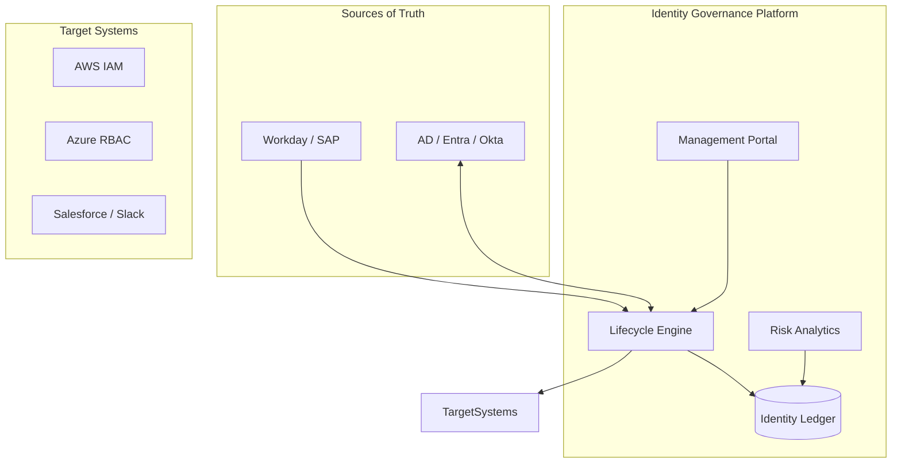

### 2. Hybrid IAM Topology
*Bridging on-premises AD forests with modern cloud identity providers.*
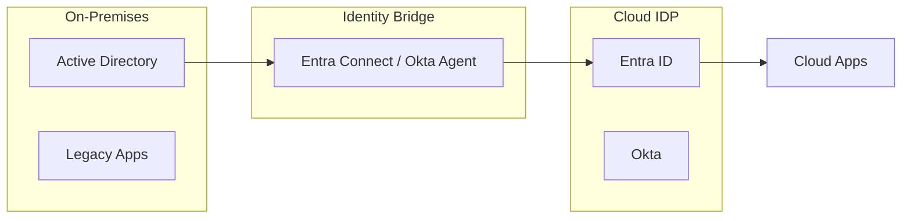

### 3. Joiner / Mover / Leaver (JML) Workflow
*The automated journey of an identity through its lifecycle.*
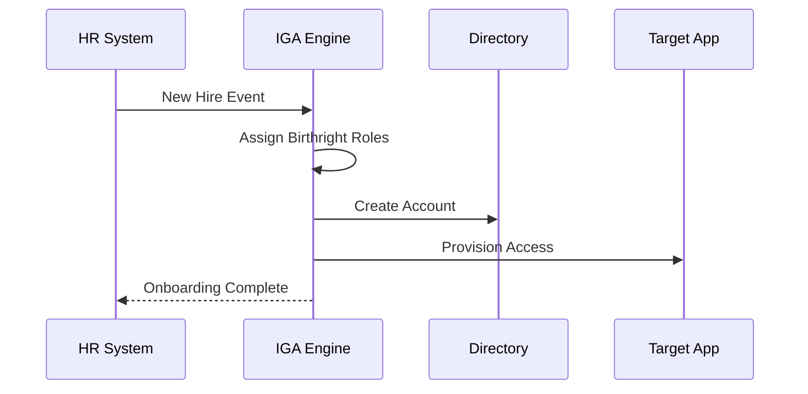

### 4. Role-Based Access Control (RBAC) Model
*Hierarchical role engineering and inheritance.*
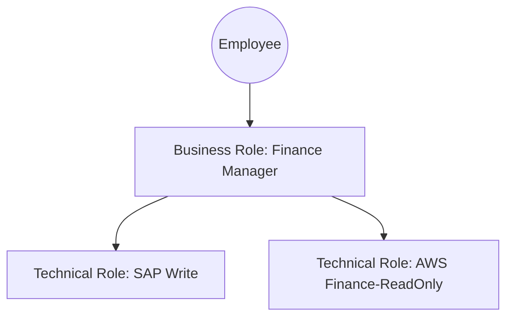

### 5. Access Recertification Cycle
*Ensuring access remains relevant and necessary.*
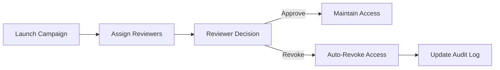

### 6. Privileged Access Management (PAM) Session
*Just-In-Time elevation for administrative tasks.*
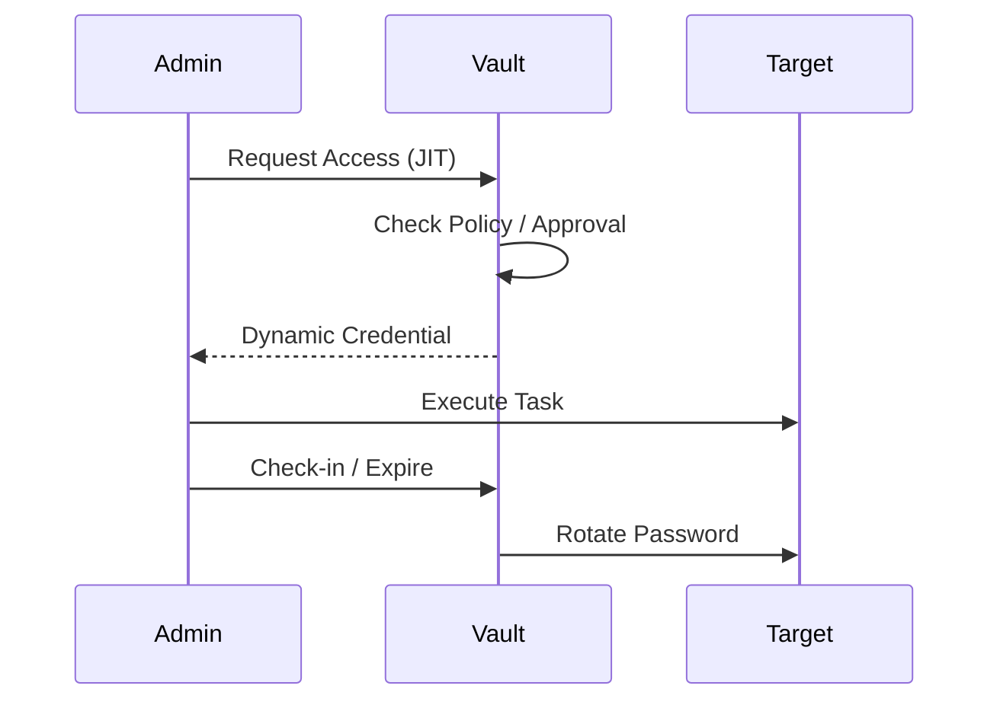

### 7. Risk-Based Access Scoring
*Visualizing the risk profile of individual identities.*
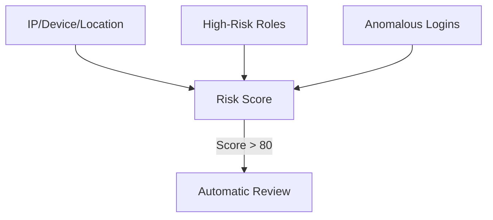

### 8. Segregation of Duties (SoD) Conflict Detection
*Preventing toxic combinations of permissions.*
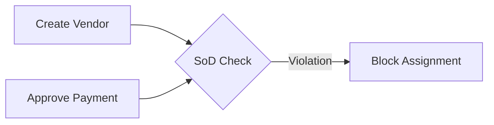

### 9. Machine Identity Lifecycle
*Managing the lifecycle of non-human entities.*
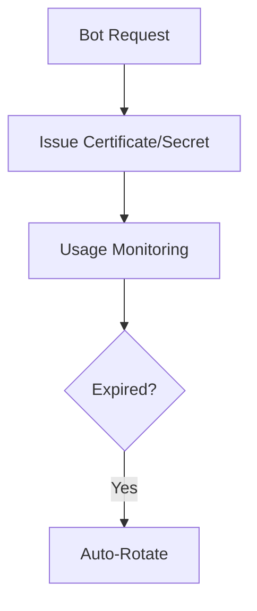

### 10. Compliance Evidence Pipeline
*Generating immutable reports for regulatory audits.*
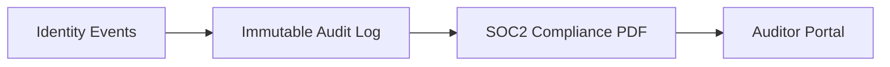

### 11. Joiner Birthright Access Model
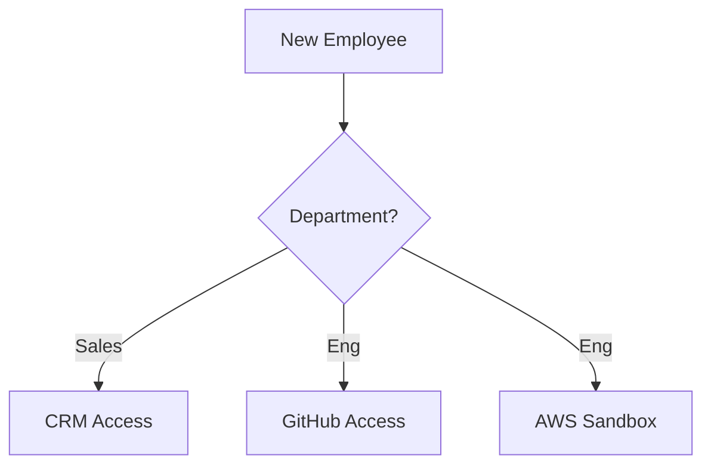

### 12. Mover Department Transfer
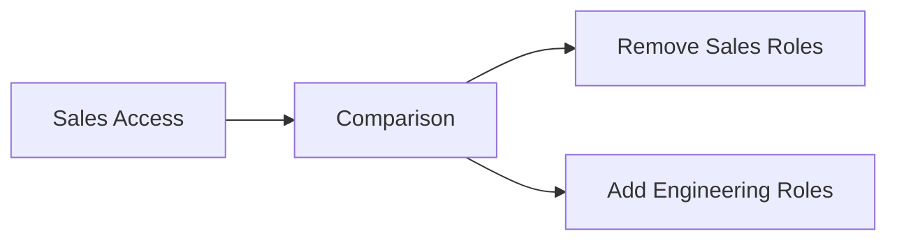

### 13. Leaver Rapid De-provisioning
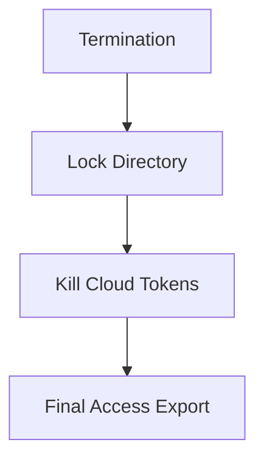

### 14. Access Request Lifecycle
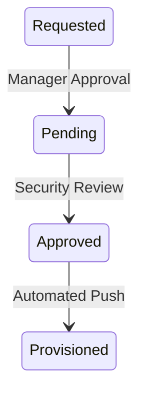

### 15. Role Mining & Analytics
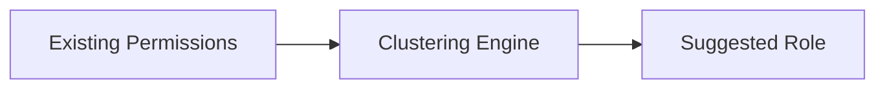

### 16. Entitlement Sprawl Analysis
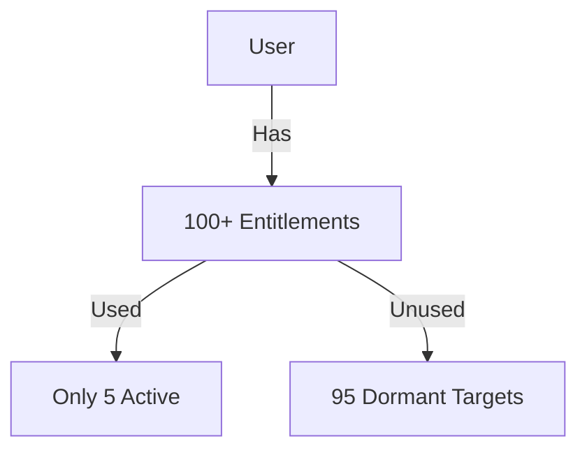

### 17. Multi-Factor Auth (MFA) Decision
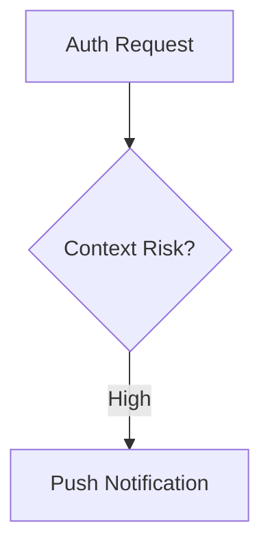

### 18. Service Account Governance
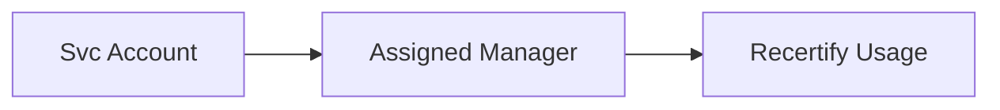

### 19. Toxic Combination Detection (SoD)
```mermaid
graph TD
    A[Role: PO Entry] + B[Role: PO Approval] --> C[Violation Alert]
```

### 20. Just-In-Time (JIT) Provisioning
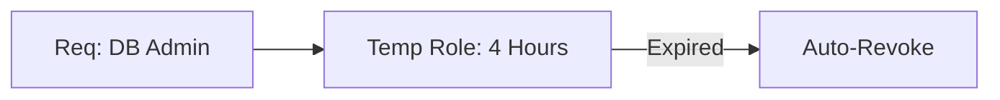

### 21. Identity Sync Pipeline
```mermaid
graph TD
    Source[Active Directory] --> Sync[Sync Agent]
    Sync --> IGA[IGA Vault]
```

### 22. Role Hierarchy Inheritance
```mermaid
graph TD
    Base[Employee Base] --> Lead[Team Lead]
    Lead --> Mgr[Department Mgr]
```

### 23. Approval Delegation Workflow
```mermaid
graph LR
    Mgr[Approver] -->|Out of Office| Del[Delegate]
    Del --> Task[Approval Action]
```

### 24. Access Request Portal Architecture
```mermaid
graph TD
    UI[Web Portal] --> Search[App Catalog]
    Search --> Cart[Request Bundle]
    Cart --> API[Workflow Engine]
```

### 25. Attestation Campaign Lifecycle
```mermaid
graph LR
    Sched[Quarterly Trigger] --> Launch[Notify Reviewers]
    Launch --> Review[Manual Review]
    Review --> End[Report Generation]
```

### 26. MFA Posture Dashboard Data Flow
```mermaid
graph TD
    IDP[Okta/Entra] --> Collector[Aggregator]
    Collector --> Viz[Posture Charts]
```

### 27. SCIM Integration Architecture
```mermaid
sequenceDiagram
    IGA->>SaaS: POST /Users (SCIM)
    SaaS-->>IGA: 201 Created
```

### 28. Behavioral Identity Analytics
```mermaid
graph LR
    Log[Auth Logs] --> UEBA[Behavior Model]
    UEBA --> Risk[Risk Score Update]
```

### 29. Privileged Session Review
```mermaid
graph TD
    Ssh[SSH Session] --> Record[Recording Storage]
    Record --> Review[Auditor Playback]
```

### 30. Governance Scorecard Metrics
```mermaid
graph LR
    Stats[Identity Stats] --> Score[Maturity Index]
```

---

## 🛠️ Technical Stack & Implementation

### Core Components
- **Orchestrator**: FastAPI / Python 3.11+
- **Database**: PostgreSQL (Identity Ledger)
- **Queue**: Redis (Asynchronous Provisioning)
- **Frontend**: React 18 / Tailwind / Recharts

### Compliance Frameworks
- **NIST 800-63**: Digital Identity Guidelines
- **SOC2 Type II**: Security, Availability, Processing Integrity
- **HIPAA**: Safeguarding Protected Health Information (PHI)

---

## 🚀 Deployment Guide

### Local Development
```bash
# Clone the repository
git clone https://github.com/devopstrio/identity-governance-framework.git
cd identity-governance-framework

# Setup environment
cp .env.example .env

# Launch platform
make up
```

### Monitoring & Operations
- **Alerting**: Real-time alerts for failed de-provisioning events.
- **Reporting**: Weekly executive summary of access risk trends.

---

<div align="center">

### 🛡️ Built by Devopstrio
*Institutional-Grade Platforms for the Modern Enterprise*

[Website](https://devopstrio.com) • [Contact](mailto:support@devopstrio.com) • [LinkedIn](https://linkedin.com/company/devopstrio)

© 2024 Devopstrio. All rights reserved.

</div>
