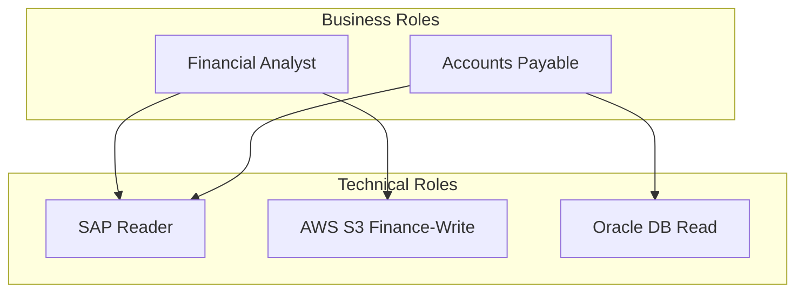
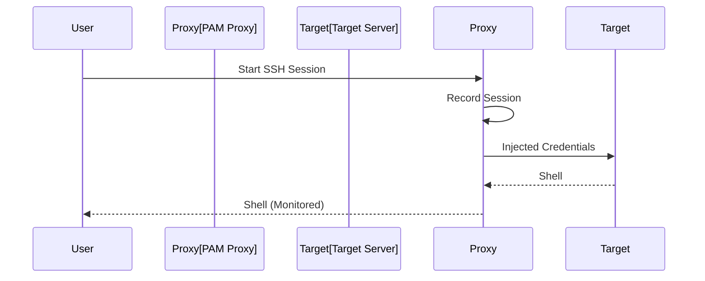
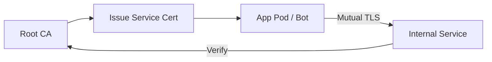

# Security & Governance Diagrams

## 22. RBAC Permission Model
*Hierarchical role assignment and inheritance.*

```mermaid
graph TD
    subgraph "Business Roles"
        BR1[Financial Analyst]
        BR2[Accounts Payable]
    end
    subgraph "Technical Roles"
        TR1[SAP Reader]
        TR2[AWS S3 Finance-Write]
        TR3[Oracle DB Read]
    end
    BR1 --> TR1
    BR1 --> TR2
    BR2 --> TR1
    BR2 --> TR3
```

## 24. PAM Session Model

```mermaid
sequenceDiagram
    participant User
    participant Proxy[PAM Proxy]
    participant Target[Target Server]
    User->>Proxy: Start SSH Session
    Proxy->>Proxy: Record Session
    Proxy->>Target: Injected Credentials
    Target-->>Proxy: Shell
    Proxy-->>User: Shell (Monitored)
```

## 40. Machine Identity PKI Flow

```mermaid
graph LR
    CA[Root CA] --> Issue[Issue Service Cert]
    Issue --> Pod[App Pod / Bot]
    Pod -- "Mutual TLS" --> Service[Internal Service]
    Service -- "Verify" --> CA
```
