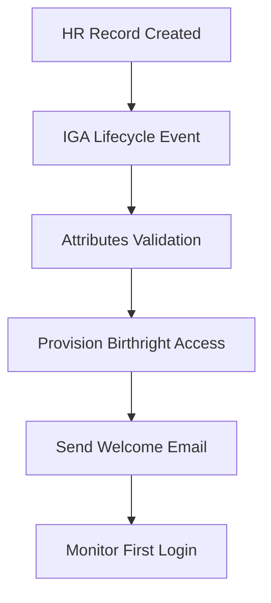
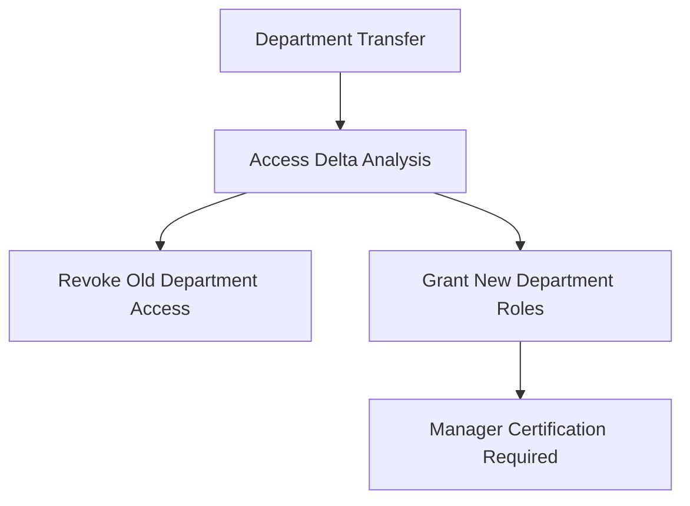
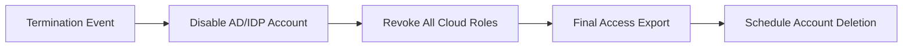

# Identity Lifecycle Diagrams

## 11. Joiner Workflow
*Automated onboarding of new employees.*

```mermaid
graph TD
    HR[HR Record Created] --> Trigger[IGA Lifecycle Event]
    Trigger --> Validation[Attributes Validation]
    Validation --> Provision[Provision Birthright Access]
    Provision --> Welcome[Send Welcome Email]
    Welcome --> Monitor[Monitor First Login]
```

## 12. Mover Workflow

```mermaid
graph TD
    Transfer[Department Transfer] --> Review[Access Delta Analysis]
    Review --> Revoke[Revoke Old Department Access]
    Review --> Grant[Grant New Department Roles]
    Grant --> Certify[Manager Certification Required]
```

## 13. Leaver Workflow

```mermaid
graph LR
    Term[Termination Event] --> Disable[Disable AD/IDP Account]
    Disable --> Revoke[Revoke All Cloud Roles]
    Revoke --> Audit[Final Access Export]
    Audit --> Delete[Schedule Account Deletion]
```
